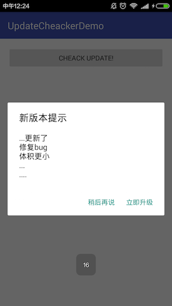
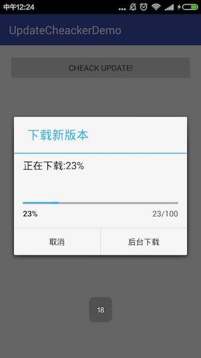
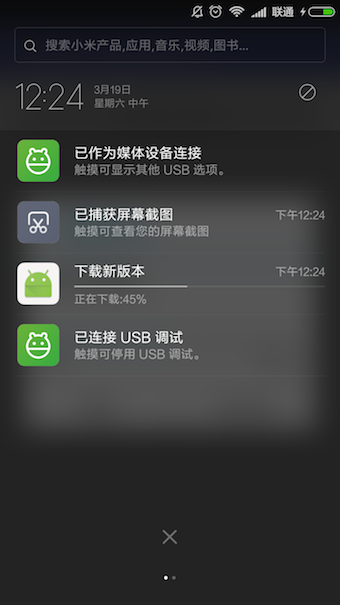
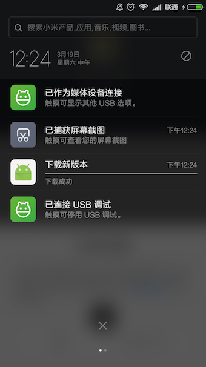

Android UpdateChecker
===================

Android Application的版本检查，下载，安装（checker download and install）

#### Usage

服务端json：

``` java
{
  "downloadUrl": "http://apk.r1.market.hiapk.com/data/upload/marketClient/HiMarket6.8.1.81_1453019187674.apk",
  "versionName": "6.8.1.81_1453019187674",
  "updateMessage": "...更新了\n修复bug\n体积更小\n...\n....\n"
}
```

客户端请求：

```java
    public void cheack(View v) {
        UpdateManager checkManager =
                new UpdateManager.UpdateBuilder(this)
                        .checkUrl(null).
                        params(null).
                        showCheckPrepareDialog(true).
                        showCheckCompleteDilog(true).
                        showProgressDialog(true).
                        showProgressNotification(true).
                        isAutoInstall(true).
                        checkCallback(new CheckCallback() {
                            @Override
                            public void onCheckUpdatePrepare() {
                            }
                            @Override
                            public void onCheckUpdateCompleted(Object checkInfo) {
                            }
                            @Override
                            public void onUICheckUpdateCompleted(Object checkInfo) {
                            }
                        }).
                        downloadCallback(new SimpleDownloadCallback() {
                            @Override
                            public void onDownloadProgressChanged(int progress) {
                                super.onDownloadProgressChanged(progress);
                                Toast.makeText(MainActivity.this, progress + "", Toast.LENGTH_LONG).show();
                            }
                        }).
                        build();
        checkManager.checkUpdate();
```

#### ScreenShot







### License
>Licensed under the Apache License, Version 2.0 (the "License");
>you may not use this file except in compliance with the License.
>You may obtain a copy of the License at

>    http://www.apache.org/licenses/LICENSE-2.0

>Unless required by applicable law or agreed to in writing, software
>distributed under the License is distributed on an "AS IS" BASIS,
>WITHOUT WARRANTIES OR CONDITIONS OF ANY KIND, either express or implied.
>See the License for the specific language governing permissions and
>limitations under the License.